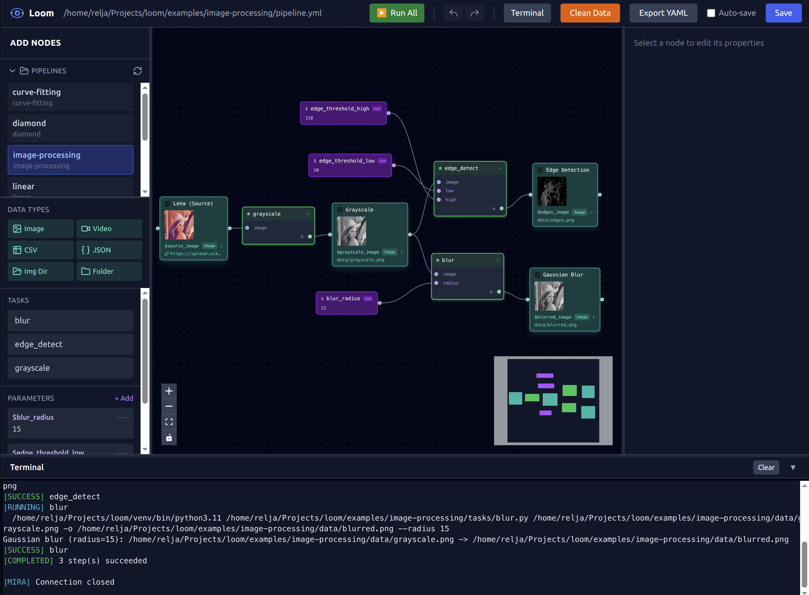

# Visual Editor

Reference for the `loom-ui` visual editor.

## Starting the Editor

```bash
# Open a pipeline
loom-ui pipeline.yml

# Browse pipelines in a directory
loom-ui experiments/

# Create a new pipeline
loom-ui --new

# Custom port
loom-ui pipeline.yml --port 8080
```

## User Interface



The editor has four main areas:

- **Toolbar** (top) — Logo, file path, run controls, save button
- **Sidebar** (left) — Add data nodes, browse tasks, manage parameters
- **Canvas** (center) — Visual graph of your pipeline
- **Properties Panel** (right) — Edit selected node, run individual steps
- **Terminal Panel** (bottom, collapsible) — Execution output

## Panels

### Sidebar (Left)

- **Data Types** — Add new data nodes to the canvas
- **Tasks** — Click to add task steps to the canvas
- **Parameters** — Add/edit configuration values

### Canvas (Center)

- Visual graph of your pipeline
- Drag nodes to arrange
- Connect steps to data nodes by dragging from handles
- Multi-select with Shift+click or drag box
- Mini-map in corner for navigation

### Properties Panel (Right)

- Edit selected node properties
- **For steps:** name, task, inputs, outputs, args
- **For data nodes:** display name, key, type, path, description
- Run/Cancel buttons for individual steps
- Shows available data/parameter references

### Terminal Panel (Bottom)

- Collapsible output panel
- Live streaming execution output
- Per-step output tabs when running parallel
- ANSI color support

## Node Types

### Data Nodes

Represent file paths or URLs:

- **Green** = file exists on disk
- **Grey** = file doesn't exist yet

### Step Nodes

Represent Python tasks:

- **Solid border** = regular step
- **Dashed border** = optional step
- Optional and disabled checkboxes in properties panel
- Shows execution state (idle, running, completed, failed)

## Keyboard Shortcuts

| Shortcut | Action |
|----------|--------|
| `Cmd/Ctrl + Z` | Undo |
| `Cmd/Ctrl + Shift + Z` | Redo |
| `Ctrl + Y` | Redo (Windows) |
| `Cmd/Ctrl + S` | Save |
| `Cmd/Ctrl + C` | Copy selected nodes |
| `Cmd/Ctrl + V` | Paste nodes |
| `Delete / Backspace` | Delete selected |

## Running Pipelines

### Run Controls (Toolbar)

- **Run All** — Execute entire pipeline
- **Stop** — Cancel running execution

### Run from Properties Panel

Select a step to access:

- **Run This Step** — Execute just this step

### Run from Toolbar

- **From Here** — Execute from the selected step and all downstream

### Execution States

| State | Indicator |
|-------|-----------|
| Idle | Default appearance |
| Running | Animated border |
| Completed | Green checkmark |
| Failed | Red indicator |

## Workspace Mode

Open a directory to browse multiple pipelines:

```bash
loom-ui experiments/
```

Features:

- Pipeline browser in sidebar
- Double-click to switch pipelines
- Prompts to save unsaved changes before switching

## Connections

### Creating Connections

1. Hover over a node handle (small circle)
2. Drag to another node's handle
3. Release to create connection

### Connection Rules

| From | To | Valid? |
|------|----|--------|
| Data node → Step input | Yes | Main data flow |
| Step output → Data node | Yes | Step produces data |
| Parameter → Step arg | Yes | Config value |
| Data node → Data node | No | Not allowed |

### Type Validation

When tasks have typed inputs/outputs, the editor validates that connected types match.

## Saving

- **Auto-save** is disabled by default
- **Unsaved changes** shown with `*` in title
- **Cmd/Ctrl + S** to save manually
- Prompted to save when switching pipelines or closing

## Tips

- **Drag from handles** to create connections
- **Double-click** data nodes to open the file path
- **Shift+click** to multi-select nodes
- **Delete key** removes selected nodes/connections
- **Mini-map** helps navigate large pipelines
