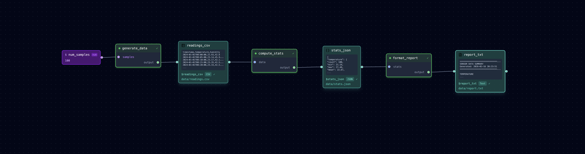

# Linear Pipeline

**What you'll learn:** Core concepts — data nodes, steps, inputs, and outputs.



## Pipeline Diagram

```
generate_data → readings.csv → compute_stats → stats.json → format_report → report.txt
```

## Run the Example

```bash
cd examples/linear
loom pipeline.yml
```

Check the outputs:

```bash
cat data/readings.csv   # Raw sensor data
cat data/stats.json     # Computed statistics
cat data/report.txt     # Human-readable report
```

## Understanding the Pipeline

```yaml
data:
  readings_csv:
    type: csv
    path: data/readings.csv
  stats_json:
    type: json
    path: data/stats.json
  report_txt:
    type: txt
    path: data/report.txt

parameters:
  num_samples: 100

pipeline:
  - name: generate_data
    task: tasks/generate_data.py
    outputs:
      --output: $readings_csv
    args:
      --samples: $num_samples

  - name: compute_stats
    task: tasks/compute_stats.py
    inputs:
      data: $readings_csv
    outputs:
      --output: $stats_json

  - name: format_report
    task: tasks/format_report.py
    inputs:
      stats: $stats_json
    outputs:
      --output: $report_txt
```

## Key Concepts

### Data Nodes

Data nodes define files in your pipeline:

```yaml
data:
  readings_csv:           # Node name (used as $readings_csv)
    type: csv             # File type (for validation)
    path: data/readings.csv  # Actual file path
```

### Steps

Steps are Python scripts that process data:

```yaml
- name: compute_stats           # Unique identifier
  task: tasks/compute_stats.py  # Path to script
  inputs:
    data: $readings_csv         # Input: reference to data node
  outputs:
    --output: $stats_json       # Output: writes to data node
```

### Variable References

The `$` prefix references a data node or parameter:

- `$readings_csv` → `data/readings.csv`
- `$num_samples` → `100`

### Dependency Chain

Loom automatically determines execution order from connections:

1. `generate_data` has no inputs → runs first
2. `compute_stats` needs `$readings_csv` → waits for `generate_data`
3. `format_report` needs `$stats_json` → waits for `compute_stats`

## Try It

```bash
# Run just one step
loom pipeline.yml --step compute_stats

# Run from a step onward
loom pipeline.yml --from compute_stats

# Preview commands without executing
loom pipeline.yml --dry-run

# Open in visual editor
loom-ui pipeline.yml
```

## Key Takeaways

- **Data nodes** define file paths that steps read and write
- **Steps** transform data by running Python scripts
- **`$references`** connect steps to data nodes
- **Execution order** is determined automatically from dependencies

## Next Tutorial

[Branching (Diamond) →](diamond.md) — Learn how to branch and merge data flows.
